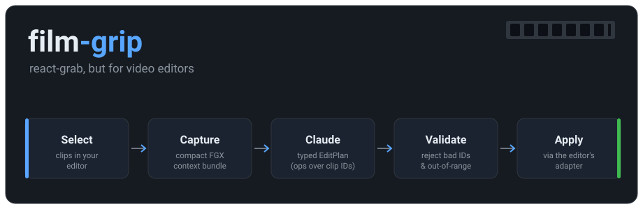
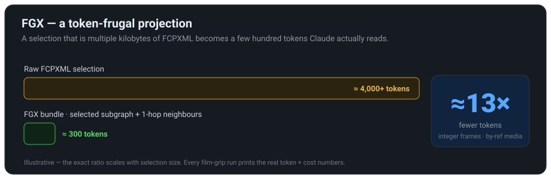
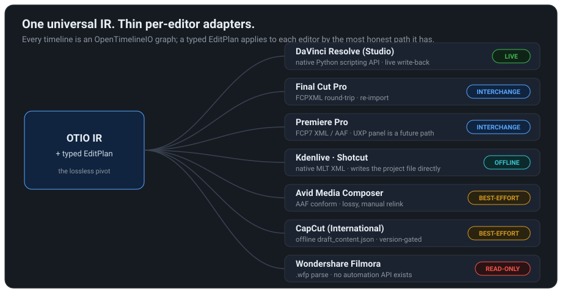

# film-grip

<p align="center">
  
</p>

**react-grab, but for video editors.** Select clips/resources inside your editor, add them to
context with a natural-language prompt, and Claude produces a *typed, validated* edit that
film-grip applies through the right per-editor adapter.

## Why it works across many editors

There is no DOM in a desktop NLE, so there is no single hook like react-grab's React-fiber
patch. film-grip's equivalent is **one universal IR + one typed protocol + thin adapters**:

- **Core IR** — every timeline is normalized to an [OpenTimelineIO](https://opentimelineio.readthedocs.io/)
  graph. OTIO is the lossless pivot; everything else is a projection of it.
- **Typed `EditPlan`** — Claude never emits editor-specific code. It proposes bounded, reversible
  primitives that reference **stable clip IDs**. Hallucinated IDs/frames can't survive validation.
  - *edit / cut*: `trim` · `move` · `insert` · `split` · `ripple` · `delete` (ripple-delete closes the gap) · `retime` (speed up / slow down / reverse / freeze-frame)
  - *audio / SFX*: `import_audio` — drop a sound effect from your library onto an audio track · audio-aware `insert`
  - *organize*: `add_track` · `rename_track` · `create_bin` · `move_to_bin`
  - *annotate / state*: `add_marker` · `set_property` · `set_enabled` (enable / disable a clip without deleting it) · `add_transition`
- **FGX serializer** — a token-frugal projection (integer frames, abbreviated rows, selected
  subgraph + 1-hop neighbors, media by reference, multi-turn deltas). A selection that is
  multiple kilobytes of raw FCPXML becomes a few hundred tokens.
- **Adapters** — Resolve native (live flagship), an OTIO-interchange family (FCP / Premiere /
  Kdenlive / Shotcut / Avid), CapCut offline-JSON, and a read-only Filmora parser.

<p align="center">
  
</p>

## Editor coverage (honest)

<p align="center">
  
</p>

| Editor | Role | Mechanism | Write-back |
|---|---|---|---|
| DaVinci Resolve (Studio) | flagship — live | native Python scripting API | yes (live) |
| Final Cut Pro | interchange | FCPXML round-trip | via re-import |
| Premiere Pro | interchange now; UXP panel later | FCP7 XML / AAF (UXP panel is a future path) | via re-import |
| Kdenlive / Shotcut | interchange (near-free) | native MLT-XML | yes (offline) |
| Avid Media Composer | best-effort / conform | AAF | lossy |
| CapCut (International) | best-effort | offline `draft_content.json` | offline only, version-gated |
| Wondershare Filmora | **read-only** | `.wfp` parse | **no** — Filmora has no automation API |

film-grip never promises automation an editor cannot deliver. Resolve has no true multi-clip
timeline-selection API; Filmora has no write-back; interchange formats are lossy by a documented
amount. Each adapter declares its capabilities and the CLI surfaces them — run `film-grip editors`
for the full per-editor + per-op matrix (also in [docs/CAPABILITIES.md](docs/CAPABILITIES.md)).

## Editing live in DaVinci Resolve

Resolve's scripting API can apply markers, properties and ripple-deletes directly, but **can't**
reposition clips precisely. So structural edits (`trim`/`move`/`split`/`insert`/`ripple`/`retime`) take the
**OTIO rebuild path**: film-grip exports the timeline to OTIO, mutates the graph, and re-imports it
as a *new* timeline — your original is left untouched. That round-trip is lossy (color grades, Fusion
comps and some transitions don't carry), and film-grip says so in the apply output rather than
silently dropping them.

## Sound effects — just tell Claude

Point film-grip at your own folder of sound effects (`~/.filmgrip/sfx`, `$FILMGRIP_SFX_DIR`, or
`--dir`). It builds a small **manifest** (names + tags, never the audio bytes) that Claude chooses
from. "add a whoosh as the title flies in" resolves to a real file, imports it into the media pool,
and lands it on an audio track.

```bash
film-grip sfx list                    # what's in your library
film-grip sfx resolve "title whoosh"  # which file a description maps to
film-grip edit "add a whoosh when the logo appears"
```

> **Honest limit:** per-clip **volume / gain / fades are not scriptable** in Resolve (they live on
> the Fairlight page). film-grip *places* the audio; level/fade tweaks stay a manual step — it will
> never pretend "lower the volume" succeeded.

## Organizing

`add_track`, `rename_track`, `create_bin` and `move_to_bin` tidy tracks and the media pool — e.g.
"make a bin called *selects* and move the hero clip into it", or "add a stereo audio track for SFX".

## Speed, reverse, freeze &amp; visibility

`retime` changes a clip's playback speed through an OpenTimelineIO time-warp — *"make the b-roll
2× faster"*, *"play the last shot in reverse"*, *"freeze the final frame"*. `speed_percent` above
100 speeds up, below 100 slows down, a negative value reverses, and `0` is a freeze-frame. It rides
the same OTIO-rebuild path as the structural edits, so it lands on every rebuild/interchange editor
and in Resolve via the rebuild (the warp changes playback within the clip's span — add a `ripple` if
you want the gap closed).

`set_enabled` mutes a clip without deleting it — *"disable the second take"* — and applies **live**
in Resolve (`SetClipEnabled`) as well as through the rebuild. Run `film-grip editors` for the
per-op, per-editor matrix so you always know which edits land where.

## A panel inside Resolve

`film-grip panel install` drops a script into Resolve's Scripts menu. Launch it from
**Workspace ▸ Scripts ▸ film-grip**: a floating panel shows your selection, takes a prompt, and
applies the edit in place. See [docs/IN_RESOLVE_PANEL.md](docs/IN_RESOLVE_PANEL.md) for how it works
and why this (not a docked panel) is the honest in-app surface.

## Errors &amp; cost

Invalid plans aren't fatal: the **repair loop** feeds the exact validation errors back to Claude
(via session resume, capped retries) so it can self-correct. Every run reports cost and the token
savings FGX buys versus dumping the raw timeline, so you can see the price of an edit.

## Billing — uses your Claude subscription

film-grip plans edits through the Claude Agent SDK and, by default, bills them to your **Claude
subscription** (Max/Pro) rather than the pay-per-token API: if an `ANTHROPIC_API_KEY` is present in
your environment it is *dropped* for the planning call so the SDK uses your logged-in Claude Code
OAuth session. Set `FILMGRIP_USE_SUBSCRIPTION=0` to bill an API key instead. `film-grip status`
reports which path is active (`subscription` / `api-key` / `none`) so the cost is never a surprise.

The planner is also provider-pluggable via `--backend` / `$FILMGRIP_BACKEND`: Claude is the live
flagship today, and a Codex/GPT backend is a ready seam (`film-grip edit --backend codex …`).

## Status

Early build. The core IR, protocol, serializer, validator and every non-live adapter are
unit-tested on fixtures **with zero editors installed**. The live Resolve path is demonstrable
with DaVinci Resolve open (Studio, external scripting enabled).

## Install

```bash
python3 -m venv .venv
.venv/bin/pip install -e ".[dev]"        # core + tests
.venv/bin/pip install -e ".[all,dev]"    # + Claude Agent SDK + AAF
.venv/bin/pytest -q
```

## Usage

```bash
# Offline, provable without any editor:
film-grip edit --fixture tests/fixtures/cut.otio --plan tests/fixtures/plan.json --dry-run

# Live, with DaVinci Resolve open:
film-grip edit "add a blue marker on the selected clip"
film-grip edit "split the interview at the playhead and tighten the open by 12 frames"
film-grip edit "add a whoosh when the title flies in, then move the b-roll to v2"
film-grip edit "make the b-roll 2x faster, reverse the last shot, and disable the second take"

film-grip status            # is film-grip able to reach your editor? (the doctor)
film-grip editors           # per-editor + per-op capability matrix
film-grip sfx list          # your sound-effects library
film-grip panel install     # add the in-Resolve panel (Workspace ▸ Scripts ▸ film-grip)
```

## License

MIT
